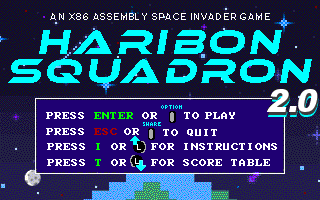

<!-- PROJECT LOGO -->
<br />
<p align="center">
  <p align="center">
    
  </p>

  <p align="center">
    Haribon Squadron 2.0 is an improvement of <a href="https://github.com/IJMPLM/Haribon-Squadron">Haribon Squadron</a>, a nostalgic space Alien-like game themed around Pamantasan ng Lungsod ng Maynila (PLM) and is written in the old x86 Assembly Language.
    <br />
</p>

<!-- TABLE OF CONTENTS -->
<details open="open">
  <summary><h2 style="display: inline-block">Table of Contents</h2></summary>
  <ol>
    <li>
      <a href="#-about-the-project">About The Project</a>
      <ul>
        <li><a href="#-gameplay-demo">Gameplay Demo</a></li>
      </ul>
    </li>
    <li>
      <a href="#-getting-started">Getting Started</a>
      <ul>
        <li><a href="#prerequisites">Prerequisites</a></li>
        <li><a href="#installation">Installation</a></li>
      </ul>
    </li>
    <li><a href="#-disclaimer">Disclaimer</a></li>
    <li><a href="#-developers">Developers</a></li>
  </ol>
</details>

<!-- ABOUT THE PROJECT -->

## 💡 About The Project

This repository contains the source code for Haribon Squadron 2.0, a fresh release based on Haribon-Squadron, a space Alien-like game themed around Pamantasan ng Lungsod ng Maynila (PLM). Primarily created as a requirement, Haribon Squadron 2.0 is built upon the source code of Haribon-Squadron with the aim of improving its existing mechanics and improving upon it by adding various gameplay and visual changes to completely enhance the game experience while showcasing the group's skills in x86 assembly language programming and designing.

### **🎮 Gameplay Demo**

  <p align="center">
    
  </p>

### **⚙ Technology Used**

1. Language: The game is written entirely in x86 assembly language.
2. Assembly: Using tasm as an assembler along with linkers such as tlink and complink.
3. Designing: <a href="http://grafx2.chez.com/index.php?static3/downloads">GrafX2 was utilized for creating all the new assets in the game.</a>
4. Environment: DOSBox v0.74-3 was used for development and release.

## 🆕 Getting Started

- ### **Prerequisites**

  - Operating System: Windows, macOS, or Linux
  - Processor: Any modern processor capable of running DOSBox
  - Memory: At least 512 MB of RAM
  - Storage: 10 MB of available disk space
  - Additional Software:
    - DOSBox (provided in this repository)
    - TASM Assembler Tools (already included in this repository)

<!-- GETTING STARTED -->

- ### **Installation**

1. **Clone the Repository**:

   ```bash
   git clone https://github.com/IJMPLM/Haribon-Squadron-2.0
   ```

2. **Change the directory to the repository**:

   ```bash
   cd C:\Haribon-Squadron-2.0

3. **Run the Haribon-Squadron-2.0 batch file**:
   ```
   Haribon-Squadron-2.0.bat
   ```


# Controller Configuration
Keyboard Input    -> Controller Input (DS4) 
- Left Arrow Key    -> Left LeftStick
- Right Arrow Key   -> Right LeftStick
- Spacebar          -> Button (X)
- Esc               -> Button (Share)
- I                 -> Up LeftStick
- T                 -> Down LeftStick
- Enter             -> Button (Options)
- Z                 -> Button (Square)
- X                 -> Button (Triangle)
- C                 -> Button (O)
<br>
<br>

❓ Troubleshooting Tips
- Controller not working? Make sure that the controller is plugged-in before running the batch file
<br>

## Developer Guide

Utilize Haribon-Squadron-2.0 - Debug.bat file to test the game after assembly. <br>
<ul>
    <lh>Current features: </lh>
    <li>Bullet Hit Coordinates </li>
    <li>Skill Availability </li>
    <li>Unli Skills</li>
</ul>


## ❗❗ Disclaimer

This project was developed for the fulfillment of the finals requirement in Architecture and Organization. The group does not own any rights to the prior used software nor does the group allow its use for production purposes.


## 👥 Developers

<b>20242 Block 3 - Group 4

<b>LEADER: IWAG, John Michael M.

- CATACUTAN, Raphael James C.
- FRIAS, Railey Miguel B.
- LAO, Jieco Andres A.
- LIBANG, Michael Angelo II M.
- MANGUNI, John Gabriel H.
- ROBANTE, Floyd M.
- SANCHEZ, Tricia Mae P.


